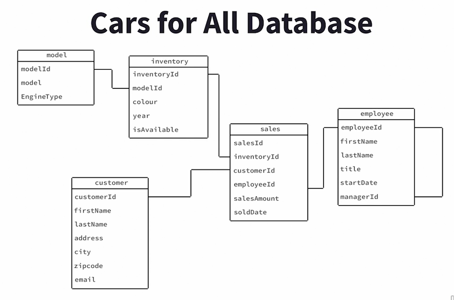

# Indexes

One common technique for improving query time is to use indexes. With indexes, we can avoid costly full table scans. Let's create an index on the salary column in the staff table.

<figure><figcaption></figcaption></figure>

If we run this there won't be anything in result.

Now, if we need to access all the rows in the table, the index won't be used. So for example, if we run the following query

<figure><figcaption></figcaption></figure>

And we see here the full table scan has performed

<figure><figcaption></figcaption></figure>

But wait, it appears that the index is still not used. Why? The reason is, is that there are so many rows with a salary greater than 75,000 that the query execution builder determined it would be faster to simply scan the whole table instead of looking up those rows in the index and then reading the table. This is a case in which our where clause is not selective enough to warrant using an index.

<figure><figcaption></figcaption></figure>

Let's try a different salary cutoff. Let's try 150,000, and we'll run that command. And here we'll see that the index is actually used. So even though we do have an index on a table, the index may not always be used. And again, the query plan builder is trying to build a plan which will take the least amount of time overall. So it'll take into consideration time to, for example, look up data that's in an index and then go look up additional data that's in a table. And so only when the conditions are highly selective are indexes used, when those conditions are so selective that they reduce the number of rows returned sufficiently so that it basically makes the query plan builder favor using an index rather than doing the brute force method of a fold table scan.

<figure><figcaption></figcaption></figure>

The big advantage of indexes is that they reduce the need of full scans. Another factor that makes indexes so helpful for querying is that indexes tend to be smaller than their corresponding tables. This means that they're more likely to fit in memory. That's great news for querying, because reading data from memory is much faster than reading from hard disks, or even solid state drives, or SSDs.

<figure><figcaption></figcaption></figure>

<figure><figcaption></figcaption></figure>

The tree is balanced because the root node is the index value that splits the range of values found in the index column. For example, if an index column has values from one to 100, then the root would be 50, or close to 50 if there isn't a 50 in the column. Each side of the tree has a subtree. The top node of the subtree splits the value of the index column so that the values less than the node value are stored to the left branch of the tree, and values greater than the value in the node are stored to the right. This pattern continues at each level of the tree until we reach the bottom.

<figure><figcaption></figcaption></figure>

B-trees make for efficient lookups because we can always determine where in a tree a node is located by looking at a node value and branching to the left or to the right until we find a value in the tree. In this example, we're looking for the value 15, so we make three comparisons at 50, 25, and 13 nodes.

To drop index

```
drop index index_name
```

#### Bitmap Index

These are well suited for low cardinality columns. Bitmap indexes store a series of bits for indexed values. The number of bits used is the same as the number of distinct values in a column.&#x20;

<figure><figcaption></figcaption></figure>

For example, a column that has either a yes or no value would require two bits, one corresponding to the yes, and one corresponding to the no. We aren't restricted to Boolean or yes/no columns. We could have three or more values. For example, if we have a pay type which has three possible values, we could use three bits to represent the pay type. One of the advantages of bitmap indexes is that we can perform Boolean operations quickly. For example, anding two bitmaps is a fast operation, so we could use it to find all union members who have hourly pay rates.

<figure><figcaption></figcaption></figure>

While bitwise operations are fast, updating bitmap indexes can be more time consuming than other indexes, so they tend to be used in read intensive use cases like data warehouses.

Now let's create an index on job title

```
create index idx_staff_job_title on staff(job_title)
```

Now if we run the query below

<figure><figcaption></figcaption></figure>

.png>)we created an index which, by default, is a B-tree index, but we're not using a B-tree index here. Instead, the query plan creates a bitmap index and performs a bitmap index scan. Now, Postgres uses those when an index scan would reach too much data, but a full table scan is not warranted. Also, notice the query plan uses a bitmap heap scan, which only visits data blocks that are needed and does not scan all the index blocks. So that's an example of a case where Postgres will create bitmaps on the fly and use those rather than the B-tree index that we actually created.

#### Hash Indexes

<figure><figcaption></figcaption></figure>

<figure><figcaption></figcaption></figure>

<figure><figcaption></figcaption></figure>

Let's create a hash index on the email column of the staff table. The email column is a good candidate for hash indexing, since the email should be unique to each person and it's likely we want to be able to, say, look up a person's data using their email. Also, it's not likely that we'd want to perform a range scan query using email address.

<figure><figcaption></figcaption></figure>

<figure><figcaption></figcaption></figure>

Now let's see what happens if we use B-Tree index

<figure><figcaption></figcaption></figure>

There's a slight differece in computational unit used by B-Tree index but if the database is large enough we'll see significant difference in performance

#### Bloom Filter Indexes

Sometimes when we write queries, we want to filter out data and find like a very specific group of rows. For example, if we're working in, say, a retail industry and we want to analyze different customers and we group customers along different attributes, like what geographic region do they live in? How frequently do they shop at a store? What's the total amount of sales they might have used? And are they a loyalty card member? And so on, and so we might have a large number of sort of conditions that we want to satisfy because we want to find something very precise. And so in that way, it's kind of like finding a needle in a haystack. And one of the questions we have or we need to address when we're tuning queries like that is how do we index a table like that in such a way that, one, it's efficient we can efficiently query the data? But also we don't want to have a crazy large number of indexes that we need to maintain, because that takes up a lot of space and every time we insert a row we need to update all of those indexes. This really is a challenge and it's almost like an edge case in indexing, but it does come up frequently enough that there are particular solutions that seem to work well. Now you might think, "Well, we just organize our data." So, for example, if we have a large number of chunks of data, which we call partitions, and we're going to be discussing that shortly, we might organize our chunks of data or our partitions in a certain way.&#x20;

<figure><figcaption></figcaption></figure>

Like, we might have a column and the column might have an integer value. And so anything with a column value of between one and 10 we put in one block, and 11 to 20 we put in another block, and so on. And that way if we know the value of the column, we can pretty quickly determine which block we should go retrieve. And that works really well. That actually is a great strategy in many cases. However, the constraint on using that is that strategy only works well when your lookup criteria is the same as your sort of organizing principle that you used for ordering the partitions. When you're looking for something or using some criteria that's different than your organizing principle for the data blocks and the partitions, then it doesn't really help so much.

<figure><figcaption></figcaption></figure>

So, for example, we might arrange our data volumes by a particular kind of code, but we might want to look up by several different codes, but of different types of codes. So, in that case, a different strategy that works well is something called a bloom filter. Now a bloom filter is basically a way of filtering out, in this case, like blocks or rows, that definitely don't meet our criteria, but the bloom filter might return some results that actually don't meet our filter criteria, but somehow they kind of slip past that check. And so what a bloom filter does is it allows us to trade off things like keeping a large number of indexes and storing a large amount of data. So we trade that for a more probabilistic approach in which we get the results back and we can know for sure that the data we're looking for is in our results, but then we may also have some extra stuff that actually didn't quite fit the filter, and that is a trade-off. And the question is, is that a good trade-off for you to make from an indexing strategy perspective?

<figure><figcaption></figcaption></figure>

Well, it depends. And it depends because a bloom filter index is probabilistic, which means it's not deterministic, we might get some results that aren't actually fitting our filter criteria. But it's really space efficient, highly space efficient. And the reason it is so space efficient is that we lose information. It's a lossy representation, unlike, say, a B-tree index where we don't lose information. So we're losing a little bit of information, but we're saving a lot on storage space. And because of this, when we get results back we may have some false positives. So if we can quickly filter through those false positives afterwards, then it may be useful to use a bloom filter. Now, typically, bloom filters are especially useful when we're querying arbitrary combinations or a large number of attributes. Now we might think, "Well, we could use B-tree indexes." And B-tree indexes in many cases are faster. But with B-tree indexes we would have to create an individual index for each column that is in the combination of columns that we're interested in querying on. That's not the case with a bloom filter.

<figure><figcaption></figcaption></figure>

With a bloom filter index, we create a single index. So, in this case, I'm going to create a custom bloom index on a table called customer features. And I'm going to assume that in this customer features table I have a bunch of columns, and I'm particularly interested in C1, C2, and so on through C8. So I have eight columns that I'm interested in. And it could be any combination, I could have values for C2, C5, C8, or I could have combinations for C1, C4, C5, C6, C7. We could use this one index for any of those combinations. We wouldn't have to have a bunch of different indexes. So, one, it's helpful because we don't have to have as many indexes. And also it's helpful because the size of the index itself can be smaller because we control the size of the bloom filter index, how much data we use to store an entry in this index, and we specify it in terms of the length of the number of bits that we want to use to represent an index entry. In this case, I'm using 160 bits to represent eight different columns. Now one thing to know is that we can trade-off storage space for more certainty around false positives. So the longer the length of the index entry, the smaller the chance of false positives being included in the results when we use this index. Now bloom filter types of index work with integers and text data types. Now, because the bloom filter index is an extension, that is, it's not part of the Postgres core, if we want to use bloom filter indexes, the first thing we need to do in our database is to create the extension, if it doesn't already exist, by using the create extension if not exists bloom command. And we just need to do that once, you know, once a database is created, and then it will be available for us. And then, we can start creating bloom filter indexes as we see here in this example at the top of the screen.

#### PostgreSQL specific indexes

<figure><figcaption></figcaption></figure>

<figure><figcaption></figcaption></figure>

<figure><figcaption></figcaption></figure>

<figure><figcaption></figcaption></figure>

But the builds can be slower than they are with GiST, and the indexes can be two to three times larger. So GIN versus GiST is an example of what we often face when we work with different kinds of algorithms, which is sometimes, we optimize for space, and sometimes, we optimize for time. And often, there's a tradeoff between the two.

<figure><figcaption></figcaption></figure>

<figure><figcaption></figcaption></figure>

The solution to this challenge is to use a hash index. Now, the reason is that the sensor ID that we're going to be looking up on is high cardinality. That means there's many, many different values, and we're using equality conditions to filter the rows. And also, hash indexes provide essentially a constant time operation. So as the size of the table grows, the size of doing the lookup in the index does not grow, which is not the case when we're using BTREE indexes.
