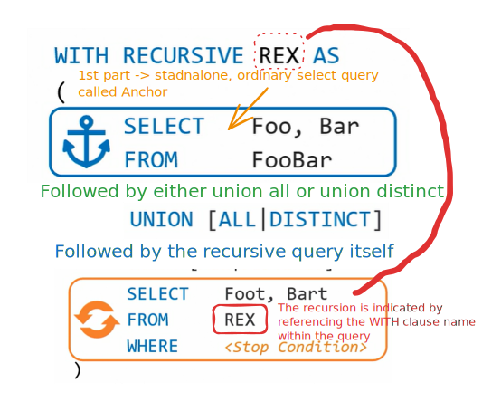

# Recursion

WITH clauses helped us break down complex tasks, shorten queries, but there's much more to them than that. WITH clauses pack a powerful and unique ability to process recursions without resorting to any type of imperative solutions. To create a recursive WITH clause, we must specify our intent using the WITH recursive keyword, the recursive query definition consists of two parts. The first is a standalone, ordinary select query called the anchor. The anchor defines the initial set, the starting point for the recursion. The anchor query is followed by either a union all or a union distinct set operator, which in turn is followed by the recursive query itself. The recursion is indicated by referencing the WITH clause name within the query.

<figure><figcaption></figcaption></figure>

As for the processing, first, the anchor query is evaluated. Here, the full bar table has one row with A and one for foo and bar respectively and this is our anchor. And with that, the anchor query has completed its job. The anchor set moves to the recursive query.

<figure><figcaption></figcaption></figure>

The recursive query is evaluated using the anchor set as its source, which produces a new result set.

<figure><figcaption></figcaption></figure>

For example, a row with B and two

<figure><figcaption></figcaption></figure>

The original anchor set is now placed in a buffer, a temporary holding place for intermediate results.

<figure><figcaption></figcaption></figure>

Then you lead generated results set, B two, takes the place of the original anchor. And now, the recursive query is evaluated once again, but this time using B two as its source data. This in turn results in a third set, the row C three.

<figure><figcaption></figcaption></figure>

The previous row, B two, is added to the buffer and the most recent one takes its place.

Either the recursive query results in an empty set or the maximum recursion depth is reached or the threshold time limit is exceeded, depending on the database that you're using.

The buffer now contains the full result set of our recursive WITH clause. Some of the common use cases for recursive WITH are to generate series, concatenate strings and traverse hierarchical data, bill of materials, organizational hierarchies and other graphs.
