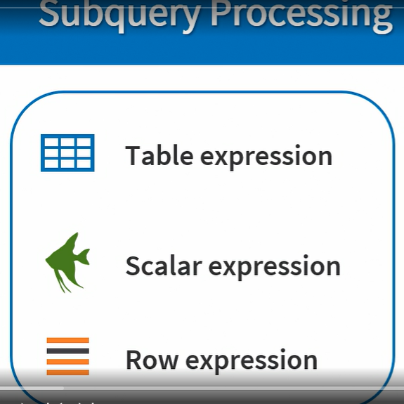

# Subquery

<figure><figcaption></figcaption></figure>

<figure><figcaption></figcaption></figure>

<figure><figcaption></figcaption></figure>

Uncorrelated subqueries may also be referred to as nested subqueries.&#x20;

In an uncorrelated subquery inner is independent of it's outer query. That means the inner query can run on its own.

<figure><figcaption></figcaption></figure>

Correlated subqueries are not efficient because of its speed optimization.&#x20;

<figure><figcaption></figcaption></figure>

Subqueries specify a table expression, a row expression, or a scalar expression. They're all derived from a query expression. In simple terms, it's a query that returns either a table, or a row, or a single value. A subquery may contain any clause except for order by, which is only allowed when used in conjunction with a limit or an offset clause.

Subqueries return a set, and a set has no order. A table subquery may return any number of rows and columns, and I will use the term derived table to refer to table expression subqueries. A row expression subquery may return only one row with one or more column. And lastly, a scalar subquery may return only one row and only one column, and that's why we can treat it as if it was a scalar expression.

Each of the three subquery types can be either correlated or non-correlated. Non-correlated subqueries are standalone queries. They are independent of the query that they are contained in, which is often called their parent or the outer query. Correlated subqueries do not stand alone. They include an expression that references a value from the outer or parent query.

<figure><figcaption></figcaption></figure>

<figure><figcaption></figcaption></figure>

Now, for another cool predicate called exists. Exists is typically used in the where clause, and is followed by a correlated subquery. It is evaluated for each row and the rows for which the sub query we turns at least one row will evaluate to true. Nothing prevents us from using a non-correlated subquery in exists, but it doesn't make much sense, since, if we do that, all rows will either evaluate to true or false.

<figure><figcaption></figcaption></figure>
