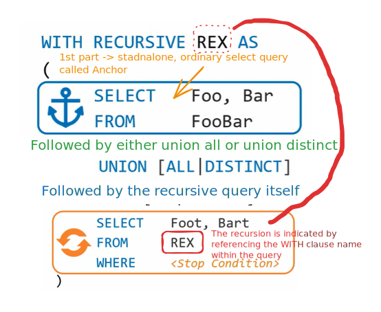

# Windows Function

<figure><figcaption></figcaption></figure>

[The difference between a standard aggregate function ](https://www.linkedin.com/learning/top-five-things-to-know-in-advanced-sql/introduction-to-window-functions?autoSkip=true\&contextUrn=urn%3Ali%3AlyndaLearningPath%3A5ee163f0498efe0ef0dfd87c\&resume=false)[like min, max and average versus a Windows function ](https://www.linkedin.com/learning/top-five-things-to-know-in-advanced-sql/introduction-to-window-functions?autoSkip=true\&contextUrn=urn%3Ali%3AlyndaLearningPath%3A5ee163f0498efe0ef0dfd87c\&resume=false)[is that a standard aggregate function operates ](https://www.linkedin.com/learning/top-five-things-to-know-in-advanced-sql/introduction-to-window-functions?autoSkip=true\&contextUrn=urn%3Ali%3AlyndaLearningPath%3A5ee163f0498efe0ef0dfd87c\&resume=false)[on the entire result set, ](https://www.linkedin.com/learning/top-five-things-to-know-in-advanced-sql/introduction-to-window-functions?autoSkip=true\&contextUrn=urn%3Ali%3AlyndaLearningPath%3A5ee163f0498efe0ef0dfd87c\&resume=false)[where Windows functions perform calculations ](https://www.linkedin.com/learning/top-five-things-to-know-in-advanced-sql/introduction-to-window-functions?autoSkip=true\&contextUrn=urn%3Ali%3AlyndaLearningPath%3A5ee163f0498efe0ef0dfd87c\&resume=false)[based on a subset of the result set ](https://www.linkedin.com/learning/top-five-things-to-know-in-advanced-sql/introduction-to-window-functions?autoSkip=true\&contextUrn=urn%3Ali%3AlyndaLearningPath%3A5ee163f0498efe0ef0dfd87c\&resume=false)[defined by a window or frame. ](https://www.linkedin.com/learning/top-five-things-to-know-in-advanced-sql/introduction-to-window-functions?autoSkip=true\&contextUrn=urn%3Ali%3AlyndaLearningPath%3A5ee163f0498efe0ef0dfd87c\&resume=false)

<figure><figcaption></figcaption></figure>

[First, we have the function name. ](https://www.linkedin.com/learning/top-five-things-to-know-in-advanced-sql/introduction-to-window-functions?autoSkip=true\&contextUrn=urn%3Ali%3AlyndaLearningPath%3A5ee163f0498efe0ef0dfd87c\&resume=false)[This is the specific type of Windows function ](https://www.linkedin.com/learning/top-five-things-to-know-in-advanced-sql/introduction-to-window-functions?autoSkip=true\&contextUrn=urn%3Ali%3AlyndaLearningPath%3A5ee163f0498efe0ef0dfd87c\&resume=false)[that you're wanting to construct, ](https://www.linkedin.com/learning/top-five-things-to-know-in-advanced-sql/introduction-to-window-functions?autoSkip=true\&contextUrn=urn%3Ali%3AlyndaLearningPath%3A5ee163f0498efe0ef0dfd87c\&resume=false)[like row number, sum or rank. ](https://www.linkedin.com/learning/top-five-things-to-know-in-advanced-sql/introduction-to-window-functions?autoSkip=true\&contextUrn=urn%3Ali%3AlyndaLearningPath%3A5ee163f0498efe0ef0dfd87c\&resume=false)[Next, we have the partition by. ](https://www.linkedin.com/learning/top-five-things-to-know-in-advanced-sql/introduction-to-window-functions?autoSkip=true\&contextUrn=urn%3Ali%3AlyndaLearningPath%3A5ee163f0498efe0ef0dfd87c\&resume=false)[This clause tells SQL over which set of data ](https://www.linkedin.com/learning/top-five-things-to-know-in-advanced-sql/introduction-to-window-functions?autoSkip=true\&contextUrn=urn%3Ali%3AlyndaLearningPath%3A5ee163f0498efe0ef0dfd87c\&resume=false)[you want to apply the operation on, ](https://www.linkedin.com/learning/top-five-things-to-know-in-advanced-sql/introduction-to-window-functions?autoSkip=true\&contextUrn=urn%3Ali%3AlyndaLearningPath%3A5ee163f0498efe0ef0dfd87c\&resume=false)[similar to a group by clause. ](https://www.linkedin.com/learning/top-five-things-to-know-in-advanced-sql/introduction-to-window-functions?autoSkip=true\&contextUrn=urn%3Ali%3AlyndaLearningPath%3A5ee163f0498efe0ef0dfd87c\&resume=false)[For example, if you're wanting to return ](https://www.linkedin.com/learning/top-five-things-to-know-in-advanced-sql/introduction-to-window-functions?autoSkip=true\&contextUrn=urn%3Ali%3AlyndaLearningPath%3A5ee163f0498efe0ef0dfd87c\&resume=false)[the sales information across a given market and date pair, ](https://www.linkedin.com/learning/top-five-things-to-know-in-advanced-sql/introduction-to-window-functions?autoSkip=true\&contextUrn=urn%3Ali%3AlyndaLearningPath%3A5ee163f0498efe0ef0dfd87c\&resume=false)[your partition by would likely include fields ](https://www.linkedin.com/learning/top-five-things-to-know-in-advanced-sql/introduction-to-window-functions?autoSkip=true\&contextUrn=urn%3Ali%3AlyndaLearningPath%3A5ee163f0498efe0ef0dfd87c\&resume=false)[that identify unique market and date pairs. ](https://www.linkedin.com/learning/top-five-things-to-know-in-advanced-sql/introduction-to-window-functions?autoSkip=true\&contextUrn=urn%3Ali%3AlyndaLearningPath%3A5ee163f0498efe0ef0dfd87c\&resume=false)[This clause is optional in a Windows function. ](https://www.linkedin.com/learning/top-five-things-to-know-in-advanced-sql/introduction-to-window-functions?autoSkip=true\&contextUrn=urn%3Ali%3AlyndaLearningPath%3A5ee163f0498efe0ef0dfd87c\&resume=false)[Next, we have the order by clause. ](https://www.linkedin.com/learning/top-five-things-to-know-in-advanced-sql/introduction-to-window-functions?autoSkip=true\&contextUrn=urn%3Ali%3AlyndaLearningPath%3A5ee163f0498efe0ef0dfd87c\&resume=false)[This clause is also optional, but it is essential ](https://www.linkedin.com/learning/top-five-things-to-know-in-advanced-sql/introduction-to-window-functions?autoSkip=true\&contextUrn=urn%3Ali%3AlyndaLearningPath%3A5ee163f0498efe0ef0dfd87c\&resume=false)[if the order of the result set of your query matter. ](https://www.linkedin.com/learning/top-five-things-to-know-in-advanced-sql/introduction-to-window-functions?autoSkip=true\&contextUrn=urn%3Ali%3AlyndaLearningPath%3A5ee163f0498efe0ef0dfd87c\&resume=false)[For example, if you're using a ranking function ](https://www.linkedin.com/learning/top-five-things-to-know-in-advanced-sql/introduction-to-window-functions?autoSkip=true\&contextUrn=urn%3Ali%3AlyndaLearningPath%3A5ee163f0498efe0ef0dfd87c\&resume=false)[to identify when an employee ](https://www.linkedin.com/learning/top-five-things-to-know-in-advanced-sql/introduction-to-window-functions?autoSkip=true\&contextUrn=urn%3Ali%3AlyndaLearningPath%3A5ee163f0498efe0ef0dfd87c\&resume=false)[in each department has the most seniority, ](https://www.linkedin.com/learning/top-five-things-to-know-in-advanced-sql/introduction-to-window-functions?autoSkip=true\&contextUrn=urn%3Ali%3AlyndaLearningPath%3A5ee163f0498efe0ef0dfd87c\&resume=false)[you will likely need to order by the employee's hire date. ](https://www.linkedin.com/learning/top-five-things-to-know-in-advanced-sql/introduction-to-window-functions?autoSkip=true\&contextUrn=urn%3Ali%3AlyndaLearningPath%3A5ee163f0498efe0ef0dfd87c\&resume=false)[Next, we have the frame specification. ](https://www.linkedin.com/learning/top-five-things-to-know-in-advanced-sql/introduction-to-window-functions?autoSkip=true\&contextUrn=urn%3Ali%3AlyndaLearningPath%3A5ee163f0498efe0ef0dfd87c\&resume=false)[The frame specification is a set of rows ](https://www.linkedin.com/learning/top-five-things-to-know-in-advanced-sql/introduction-to-window-functions?autoSkip=true\&contextUrn=urn%3Ali%3AlyndaLearningPath%3A5ee163f0498efe0ef0dfd87c\&resume=false)[or range to limit the results of your Windows function. ](https://www.linkedin.com/learning/top-five-things-to-know-in-advanced-sql/introduction-to-window-functions?autoSkip=true\&contextUrn=urn%3Ali%3AlyndaLearningPath%3A5ee163f0498efe0ef0dfd87c\&resume=false)[Some options for frame keywords include ](https://www.linkedin.com/learning/top-five-things-to-know-in-advanced-sql/introduction-to-window-functions?autoSkip=true\&contextUrn=urn%3Ali%3AlyndaLearningPath%3A5ee163f0498efe0ef0dfd87c\&resume=false)[current row, unbounded preceding and preceding. ](https://www.linkedin.com/learning/top-five-things-to-know-in-advanced-sql/introduction-to-window-functions?autoSkip=true\&contextUrn=urn%3Ali%3AlyndaLearningPath%3A5ee163f0498efe0ef0dfd87c\&resume=false)[For example, if you have a dataset ](https://www.linkedin.com/learning/top-five-things-to-know-in-advanced-sql/introduction-to-window-functions?autoSkip=true\&contextUrn=urn%3Ali%3AlyndaLearningPath%3A5ee163f0498efe0ef0dfd87c\&resume=false)[that is broken down at the daily level ](https://www.linkedin.com/learning/top-five-things-to-know-in-advanced-sql/introduction-to-window-functions?autoSkip=true\&contextUrn=urn%3Ali%3AlyndaLearningPath%3A5ee163f0498efe0ef0dfd87c\&resume=false)[and want to calculate a seven-day moving average, ](https://www.linkedin.com/learning/top-five-things-to-know-in-advanced-sql/introduction-to-window-functions?autoSkip=true\&contextUrn=urn%3Ali%3AlyndaLearningPath%3A5ee163f0498efe0ef0dfd87c\&resume=false)[you'll want to set the range to look ](https://www.linkedin.com/learning/top-five-things-to-know-in-advanced-sql/introduction-to-window-functions?autoSkip=true\&contextUrn=urn%3Ali%3AlyndaLearningPath%3A5ee163f0498efe0ef0dfd87c\&resume=false)[at the current row and values for the preceding six rows.](https://www.linkedin.com/learning/top-five-things-to-know-in-advanced-sql/introduction-to-window-functions?autoSkip=true\&contextUrn=urn%3Ali%3AlyndaLearningPath%3A5ee163f0498efe0ef0dfd87c\&resume=false)

The row-number() window function will assign a number to the rows to the windows (which are similar to groups) selected in partition by

[One thing that's important to point out ](https://www.linkedin.com/learning/top-five-things-to-know-in-advanced-sql/diving-into-row-number?autoSkip=true\&contextUrn=urn%3Ali%3AlyndaLearningPath%3A5ee163f0498efe0ef0dfd87c\&resume=false)[about the row number function is that ](https://www.linkedin.com/learning/top-five-things-to-know-in-advanced-sql/diving-into-row-number?autoSkip=true\&contextUrn=urn%3Ali%3AlyndaLearningPath%3A5ee163f0498efe0ef0dfd87c\&resume=false)[if there are ties or maybe even duplicates ](https://www.linkedin.com/learning/top-five-things-to-know-in-advanced-sql/diving-into-row-number?autoSkip=true\&contextUrn=urn%3Ali%3AlyndaLearningPath%3A5ee163f0498efe0ef0dfd87c\&resume=false)[between your criteria and no clear tie breakers, ](https://www.linkedin.com/learning/top-five-things-to-know-in-advanced-sql/diving-into-row-number?autoSkip=true\&contextUrn=urn%3Ali%3AlyndaLearningPath%3A5ee163f0498efe0ef0dfd87c\&resume=false)[in this example, it would be ](https://www.linkedin.com/learning/top-five-things-to-know-in-advanced-sql/diving-into-row-number?autoSkip=true\&contextUrn=urn%3Ali%3AlyndaLearningPath%3A5ee163f0498efe0ef0dfd87c\&resume=false)[like a customer placing two separate orders on the same day, ](https://www.linkedin.com/learning/top-five-things-to-know-in-advanced-sql/diving-into-row-number?autoSkip=true\&contextUrn=urn%3Ali%3AlyndaLearningPath%3A5ee163f0498efe0ef0dfd87c\&resume=false)[then row number will continue to numerate each row ](https://www.linkedin.com/learning/top-five-things-to-know-in-advanced-sql/diving-into-row-number?autoSkip=true\&contextUrn=urn%3Ali%3AlyndaLearningPath%3A5ee163f0498efe0ef0dfd87c\&resume=false)[in the results set without skipping values. ](https://www.linkedin.com/learning/top-five-things-to-know-in-advanced-sql/diving-into-row-number?autoSkip=true\&contextUrn=urn%3Ali%3AlyndaLearningPath%3A5ee163f0498efe0ef0dfd87c\&resume=false)

SInce row number may change if we run the query again based on whether the data changes or not and the row numbers are not immnutable that why they are not suitable for primary key.&#x20;

[Windows function column cannot be filtered ](https://www.linkedin.com/learning/top-five-things-to-know-in-advanced-sql/diving-into-row-number?autoSkip=true\&contextUrn=urn%3Ali%3AlyndaLearningPath%3A5ee163f0498efe0ef0dfd87c\&resume=false)[on using the where clause, but the reason for this ](https://www.linkedin.com/learning/top-five-things-to-know-in-advanced-sql/diving-into-row-number?autoSkip=true\&contextUrn=urn%3Ali%3AlyndaLearningPath%3A5ee163f0498efe0ef0dfd87c\&resume=false)[is that in the SQL order of operations, ](https://www.linkedin.com/learning/top-five-things-to-know-in-advanced-sql/diving-into-row-number?autoSkip=true\&contextUrn=urn%3Ali%3AlyndaLearningPath%3A5ee163f0498efe0ef0dfd87c\&resume=false)[the where clause is actually executed ](https://www.linkedin.com/learning/top-five-things-to-know-in-advanced-sql/diving-into-row-number?autoSkip=true\&contextUrn=urn%3Ali%3AlyndaLearningPath%3A5ee163f0498efe0ef0dfd87c\&resume=false)[before the Windows function. ](https://www.linkedin.com/learning/top-five-things-to-know-in-advanced-sql/diving-into-row-number?autoSkip=true\&contextUrn=urn%3Ali%3AlyndaLearningPath%3A5ee163f0498efe0ef0dfd87c\&resume=false)[So at the time where the where clause is executed, ](https://www.linkedin.com/learning/top-five-things-to-know-in-advanced-sql/diving-into-row-number?autoSkip=true\&contextUrn=urn%3Ali%3AlyndaLearningPath%3A5ee163f0498efe0ef0dfd87c\&resume=false)[the Windows column does not yet exist, ](https://www.linkedin.com/learning/top-five-things-to-know-in-advanced-sql/diving-into-row-number?autoSkip=true\&contextUrn=urn%3Ali%3AlyndaLearningPath%3A5ee163f0498efe0ef0dfd87c\&resume=false)[and that's why we receive this error. ](https://www.linkedin.com/learning/top-five-things-to-know-in-advanced-sql/diving-into-row-number?autoSkip=true\&contextUrn=urn%3Ali%3AlyndaLearningPath%3A5ee163f0498efe0ef0dfd87c\&resume=false)
